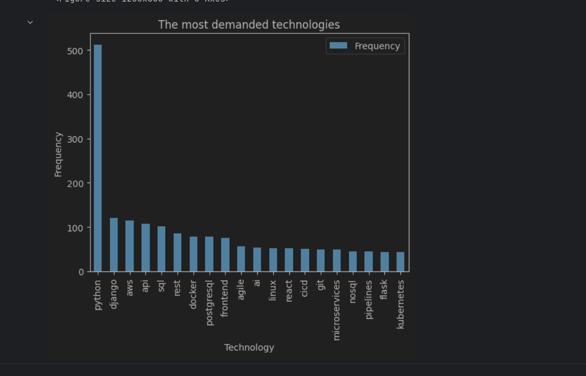

# PyTechDemand

Job Description Analysis

## Description

This project collects job descriptions from a Djinni website and performs analysis on the collected data. It extracts job titles and descriptions, stores them in a CSV file, and then analyzes the text to identify the most frequently mentioned technologies. The project also provides a bar plot visualization of the most demanded technologies.

## What it uses

- Python 3.x
- aiohttp
- asyncio
- BeautifulSoup
- csv
- dataclasses
- matplotlib
- nltk
- pandas
- string (part of the Python Standard Library)

## Installation

1. Clone the repository:
   ```shell
   git clone https://github.com/oksana-feshchenko/PyTechDemand-.git
   ```

2. Navigate to the project directory:
   ```shell
   cd your-repository
   ```

3. Create venv and install the required dependencies:
   ```shell
   python -m venv venv
   venv\Scripts\activate (on Windows)
   source venv/bin/activate (on macOS)
   pip install -r requirements.txt

   ```

## Usage

### Running the Python Script

1. Run the `parse.py` script to collect job descriptions and perform analysis:
   ```shell
   python parse.py
   ```

   This script will scrape job descriptions from the specified website.


### Running the IPython Notebook

1. Launch Jupyter Notebook:
   ```shell
   jupyter notebook
   ```

2. Open the `analysys.ipynb` file in the Jupyter Notebook interface.

3. Press `Shift + Enter` or click the "Run" button in the toolbar to execute the selected code cell.

4. The code will be executed, and any output or results will be displayed in the notebook interface.

5. Repeat the above steps for any other code cells in the notebook that you want to run.

This code  process the text to remove stopwords and unwanted characters, and generate a bar plot of the most frequently mentioned technologies.

Note that the code cells in Jupyter Notebooks are designed to be run sequentially, so it's important to run them in the correct order if there are dependencies between the cells. If you encounter any errors, make sure to check the order of cell execution and any required dependencies.

## Customization

- To modify the URL of the job listings website, update the `URL` variable in `parse.py` if you want to know about other position demands.

- Your could add int parameter to get_job_descriptions() (1,2,5) to understand junior/middle/senior requirements.
- If you want to add additional stopwords, add them to my_custom_stopwords.text.

## Result should look like this
 .

